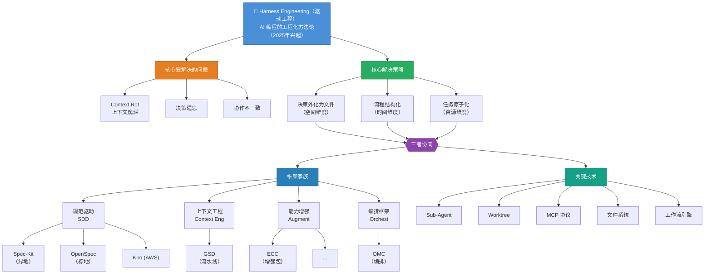

# 知识图谱与学习大纲

## 一、知识图谱总览


---

## 二、知识图谱：分层详解

### 第一层：核心概念层（必须掌握）

| 概念 | 一句话定义 | 重要性 |
|------|-----------|--------|
| **Harness Engineering** | 用工程化基础设施约束 AI 编码代理的方法论 | 核心 |
| **Context Rot** | LLM 因长上下文累积导致的输出质量退化 | 核心 |
| **Spec-Driven Development (SDD)** | 规范先于代码的开发范式 | 核心 |
| **Context Engineering** | 主动管理上下文窗口的技术 | 核心 |
| **决策外化** | 把决策从对话搬到文件系统 | 核心 |
| **流程阶段化** | 把端到端编程切分为有序阶段 | 核心 |
| **任务原子化** | 把大任务拆为可独立执行的单元 | 核心 |

### 第二层：理解层（帮助深度理解）

| 概念 | 一句话定义 | 与核心的关系 |
|------|-----------|------------|
| **Constitution** | 项目级不可妥协的原则 | 决策外化的最高层 |
| **Delta Spec** | 增量式规范（只描述变更部分） | OpenSpec 的核心机制 |
| **Sub-Agent** | 独立上下文的子代理 | 任务原子化的执行载体 |
| **Wave Execution** | 任务波次并行执行 | GSD 的核心调度模型 |
| **Lost in the Middle** | 长上下文中部信息召回率下降 | Context Rot 的理论根源 |
| **ADR** | 架构决策记录 | 决策外化的经典实践 |
| **Hooks** | 事件触发的自动化脚本 | ECC 的核心机制 |

### 第三层：进阶层（高级用法/原理）

| 概念 | 一句话定义 |
|------|-----------|
| **Brownfield-First** | 棕地优先的设计哲学（OpenSpec） |
| **Greenfield Optimization** | 绿地优化的设计哲学（Spec-Kit） |
| **Red/Blue/Auditor** | 红蓝队对抗审计模式（ECC） |
| **AgentShield** | ECC 的安全审计子系统 |
| **Skill-Agent-Command 三层模型** | ECC 的能力组织方式 |
| **DAG 任务依赖** | 用有向无环图管理任务依赖 |
| **Living Documentation** | 与代码同步演进的活文档 |

### 第四层：相关领域

| 领域 | 与 Harness 的关系 |
|------|------------------|
| **DevOps** | CI/CD 流水线为 Harness 提供执行基础 |
| **微服务架构** | 任务原子化与微服务有同构性 |
| **领域驱动设计 (DDD)** | 规范驱动的方法学源头 |
| **MLOps** | 模型版本管理思想可借鉴 |
| **Prompt Engineering** | Harness 是 Prompt Engineering 的工程化升级 |

---

## 三、知识结构总览

```
Theme 1: 领域全景与核心问题  
   ├── Harness Engineering 是什么
   ├── 解决什么问题（Context Rot）
   └── 主流框架家族图谱

Theme 2: 三个核心原理    
   ├── 决策外化为文件（空间维度）
   ├── 流程结构化为阶段（时间维度）
   └── 任务原子化为单元（资源维度）

Theme 3: 规范驱动框架（SDD） 
   ├── Spec-Kit 实战流程
   ├── OpenSpec 实战流程（本次深度剖析）
   └── 微服务场景对比

Theme 4: 能力增强框架    
   ├── ECC 三层架构
   ├── 红蓝队审计机制
   └── Skills/Agents/Commands

Theme 5: 上下文工程框架
   ├── GSD 实战详解
   ├── 波次执行（Wave Execution）
   └── 与 SDD 的组合使用

Theme 6: 编排与协作框架
   ├── OMC 多代理编排
   ├── Trellis 项目记忆
   └── 框架间的组合策略

Theme 7: 落地实战
   ├── 选型决策树
   ├── 自建 Harness
   └── 团队推行策略
```

---

## 四、推荐学习路径

### 阶段 0：建立全局认知

**目标**：理解 Harness 是什么、解决什么问题、有哪些主流方案，建立完整的领域鸟瞰

**学习内容**：

- [Harness Engineering 入门导论](01%20入门导论.md)

**完成标志**：

- 能用 1 段话向同事解释什么是 Harness Engineering
- 能区分 Vibe Coding、Spec Coding、Harness Engineering 三个概念
- 能说清 Context Rot 的成因和危害

---

### 阶段 1：吃透Harness核心原理

**目标**：理解 Harness 设计的底层哲学，能反推任意框架的设计动机

**学习内容**：

- [核心原理：决策外化为文件](02%20核心原理：决策外化为文件.md) 
- [核心原理：流程结构化为阶段](03%20核心原理：流程结构化为阶段.md) 
- [核心原理：任务原子化为可独立执行的单元](04%20核心原理：任务原子化为可独立执行的单元.md) 

**完成标志**：看到任何新 Harness 框架，能立刻识别它在三个维度上分别做了什么

---

### 阶段 2： 深扒三类代表框架

**目标**：通过 OpenSpec、 GSD 和 ECC 这三个代表，分别掌握"规范驱动"、"任务原子化"、和"能力增强"三类极致设计范式

**学习内容**：

- [OpenSpec 深度剖析](05%20OpenSpec%20深度剖析：规范驱动框架的代表作.md) 
- [ECC 深度剖析](06%20ECC%20深度剖析：能力增强框架的代表作.md)
- [GSD 深度剖析](07%20GSD%20深度剖析：上下文工程的极致代表.md) 

**完成标志**：

- 能描述 OpenSpec 的 Delta Spec 设计哲学，并解释为什么适合棕地
- 能描述 ECC 的三层架构（Skills/Agents/Commands），并解释红蓝队审计的价值
- 能搭建一个 200K Token 上限、自动 `/clear` 的工作流
  
---

### 阶段 3：编排与组合（进阶）

**目标**：学习如何把多个框架组合起来，发挥 1+1>2 的效果

**学习内容**：
- [多框架组合实战：Harness Engineering 的协奏曲](08%20多框架组合实战：Harness%20Engineering%20的协奏曲.md) 

---

### 阶段 4：落地实战（最终目标）

**目标**：在自己的项目中真正用起来

**学习内容**：
- [必读：快速试用与适配性评估](09%20快速试用与适配性评估.md) 
- 如果你的业务适合复用已有的 harness 框架，则重点参考 [落地实战指南](10%20落地实战指南.md) 
- 如果你的业务套用现有 harness 框架存在明显短板，请看 [定制业务独特的工作流](11%20定制业务独特的工作流.md) 

**推荐路径**：
1. 选一个**小项目**进行快速试用与适配性评估
2. 根据评估结果决定是要【直接落地】还是需要【定制设计】
3. 无论是哪一种方案，都需要铭记三个原则：每个决策外化、严格走阶段、任务原子化
4. 复盘：哪些原理生效了？哪些有摩擦？

**完成标志**：
- 完成试用评估报告
- 明确选定实施路径
- 项目中已稳定运行选定的工作流（或确认"暂不实施"是合理决策）

---

## 五、推荐资源清单

### 快速入门（适合初学）

| 资源 | 类型 | 适合场景 |
|------|------|----------|
| [GitHub - spec-kit](https://github.com/github/spec-kit) | 官方仓库 | 必读 |
| [GitHub - OpenSpec](https://github.com/Fission-AI/OpenSpec) | 官方仓库 | 必读 |
| [GSD 框架实战](https://blog.zhijun.io/posts/gsd-get-shit-done-project-framework) | 博客 | 理解上下文工程 |

### 系统学习（适合深入）

| 资源 | 类型 | 适合场景 |
|------|------|----------|
| [掘金 - 6 个代表性 AI 编程 Harness 工程化框架拆解](https://article.juejin.cn/post/7626998085928189998) | 博客 | 横向对比 |
| [Lost in the Middle 论文](https://arxiv.org/abs/2307.03172) | 学术论文 | 理论根源 |
| [Anthropic - Subagents 文档](https://docs.claude.com/en/docs/claude-code/sub-agents) | 官方文档 | 子代理机制 |

### 实践资源

| 资源 | 类型 |
|------|------|
| spec-kit 自带的 examples | 示例代码 |
| OpenSpec 实战教程系列 | 博客 |
| Claude Code 官方文档 | 官方文档 |

---

## 六、学习里程碑自测

### 阶段 1 自测（核心原理）

- [ ] 能用 30 秒解释什么是 Context Rot
- [ ] 能说出"决策外化"解决的三个具体问题
- [ ] 能说出"阶段化"的三大原则（先 What 后 How、先全局后局部、先拆解后执行）
- [ ] 能说出"原子化"的三个标准（足迹 < 50%、依赖闭包、二元判定）

### 阶段 2 自测（框架理解）

- [ ] 能在白板上画出 Spec-Kit 的五阶段工作流
- [ ] 能解释 OpenSpec 的 Delta Spec 三种操作（ADDED/MODIFIED/REMOVED）
- [ ] 能解释 ECC 的三层架构（Skills/Agents/Commands）的关系
- [ ] 能说出"红蓝队审计"在 ECC 中是什么角色

### 阶段 3 自测（系统选型）

- [ ] 给定一个项目场景（绿地/棕地/合规），能给出推荐框架并说明理由
- [ ] 能解释为什么 OpenSpec 不适合从零搭建（vs Spec-Kit）
- [ ] 能解释 GSD 和 SDD 框架的互补关系

### 阶段 4 自测（组合实战）

- [ ] 能在自己项目中搭建 constitution.md
- [ ] 能用 OpenSpec 提案一个真实变更（propose → apply → archive）
- [ ] 能写出一份原子化的 tasks.md（每条 30 分钟内可完成）

---

## 七、薄弱点诊断

基于本次对话观察到的你的薄弱点：

### 已经掌握（推测）
- 微服务架构的基础
- AI 编程基础流程

### 仍需加强的可能领域
- **上下文工程的工程化实现**：GSD 的子代理 + 波次执行如何真正落地
- **多框架组合策略**：实际项目中如何混搭 SDD + 上下文工程
- **团队推行**：如何说服团队接受 Harness（非技术问题但更关键）

### 推荐的深入方向
1. **优先**：GSD 实战（补全上下文工程那一块）
2. **其次**：选一个小项目做端到端的 Harness 落地
3. **可选**：深入理解 ADR、Living Documentation 等经典实践